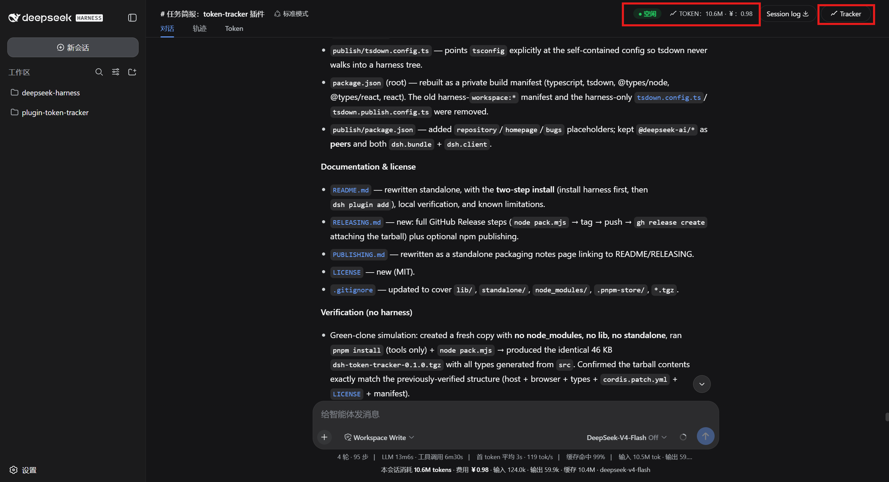
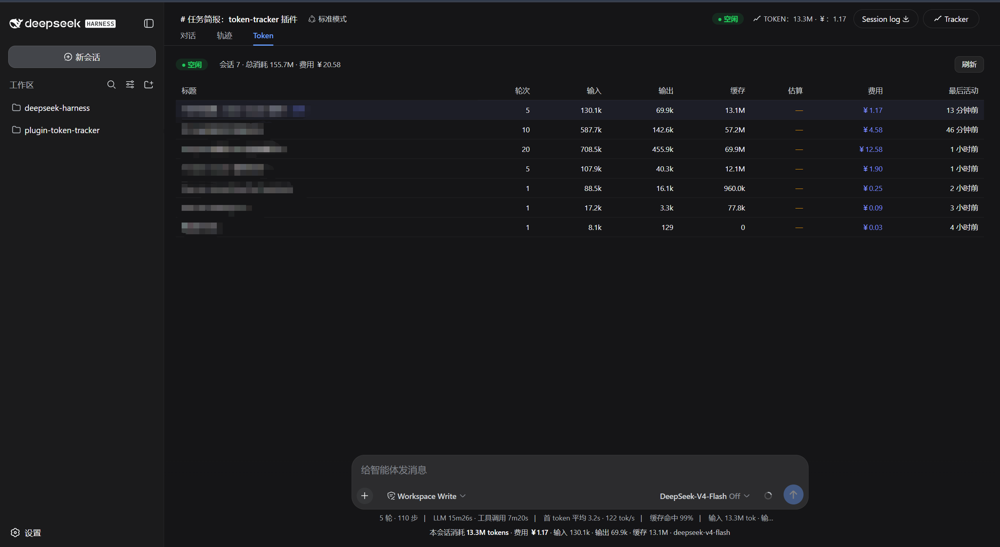
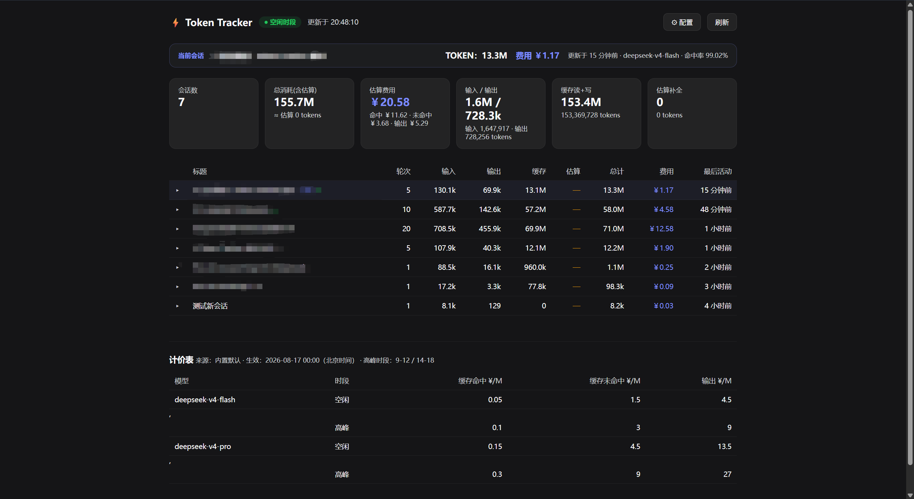

# dsh-token-tracker

> **[English](README.md)** · 阅读本页的**简体中文**版本

`dsh-token-tracker` 是一个 **dsh**（DeepSeek-Harness）web 插件：它从持久化的会话日志里汇总各家 provider 上报的 token 用量，用「峰谷计价表」计算费用，并在 dsh web GUI 中展示 —— 头部 token 徽章 + 时段标签、Tracker 按钮、输入框下方 dock 行、回合结束尾巴、注入的 `conversation.view`「Token」页签 —— 同时提供独立总览页和 JSON API。

本仓库是该插件的**独立、可分发的源码**，不包含 harness 副本。运行 `node pack.mjs` 即可产出自包含的可安装 tarball（`dsh-token-tracker-<version>.tgz`），用户用 `dsh plugin add` 安装；发布物通过本仓库的 GitHub Release 分发。

> 注意：这不是 harness 仓库内的 `@deepseek-ai/dsh-token-tracker` 包（那个是由工作区构建的内置集成版）。两者共用同一份 `src/`，此处只是把它包装成可独立分发。

### 截图

| GUI 头部的 token 徽章与时段标签 | 会话「Token」页签 / 输入框 dock 行 | 独立总览页 |
| --- | --- | --- |
|  |  |  |

### 功能

插件分 Host 半部与 Browser 半部。

**Host 半部**（`TokenTrackerService`，作为 `webServer` 的服务消费者挂载）：

- 监听 `session/event`，把 `assistant/message` 事件里 provider 上报的 `usage` 折叠成每个会话/每轮的 token 桶；每条消息按最近一次 `request/header` 里的模型名、以及事件时间对应的北京小时来归置。
- 在 `GET /dsh-token-tracker` 提供独立总览页，`GET /dsh-token-tracker/api` 提供 JSON API（`?session=<id>` 返回单会话总用量 + 每轮明细）。
- 用峰谷计价表（元 / 每百万 tokens）计费。计价表按优先级取：浏览器 localStorage 覆盖 → 工作区根目录或某个会话 cwd 下的 `token-pricing.json` → 内置默认（见 `src/pricing.ts`）。覆盖项会以短缓存被识别。

**Browser 半部**（`src/client/`）：注册头部 token 徽章 + 时段标签、Tracker 按钮、输入框 dock 行、回合结束尾巴，以及 `conversation.view`「Token」页签。所有数据都从 Host 的 JSON API 拉取，因此 typert Remote 不需要挂在浏览器装配总线上。

### 环境要求

- **Node.js** ≥ 20 与 **pnpm**（构建 tarball / 跑辅助脚本用）；插件本体跑在 harness 的 `dsh` 宿主内。
- **dsh harness**（DeepSeek-Harness），版本需与本包 peer 依赖匹配。本插件是 `@deepseek-ai/dsh-*` 运行时包的 peer，**不会**自带这些包。

---

### 安装插件（两步）

> **重要**：本插件把 `@deepseek-ai/dsh-*` harness 包声明为 **peerDependencies**（而非 `dependencies`），刻意不从 npm registry 拉取它们。因此安装顺序至关重要。

**第 1 步 —— 先装 harness**

`dsh` 需要一个 harness 安装来满足 peer 依赖。先克隆并安装 DeepSeek-Harness：

```sh
git clone --depth 1 https://github.com/deepseek-ai/deepseek-harness.git
cd deepseek-harness
pnpm install          # 在本地树中安装全部 @deepseek-ai/dsh-* 依赖
```

**第 2 步 —— 再装插件**

从 [Releases](/releases) 页面下载 `dsh-token-tracker-<version>.tgz`，然后把它加入某个 dsh profile：

```sh
dsh plugin --profile web add ./dsh-token-tracker-<version>.tgz
```

这会激活 **bundle** 层（`dsh.bundle` → `cordis.patch.yml`，插入 `token-tracker` 这一行）；同包的 `dsh.client` 清单会让浏览器半部被自动发现并从 web app 提供出来。

验证 layer 已加载，然后启动 web 服务器：

```sh
dsh --profile web --dump-config     # 应能看到 token-tracker 这一层
dsh --profile web                   # 启动 GUI + web 服务器
```

然后访问：

- `http://127.0.0.1:<port>/dsh-token-tracker` —— 总览页
- `http://127.0.0.1:<port>/dsh-token-tracker/api` —— JSON
- web GUI 头部徽章 / Token 页签

> 如果系统 `PATH` 里没有 `dsh`，可用 harness 里的本地二进制：先在 harness 目录执行 `./node_modules/.bin/dsh ...`。

**（可选，后续）从 npm 安装**：将来若发布到个人 scope 的 npm 包，peer 规则相同，只需把 `dsh plugin add` 指向包名：

```sh
# 先按 RELEASING.md 改 scope 包名，然后：
dsh plugin --profile web add @your-scope/dsh-token-tracker
```

---

### 计价覆盖

在工作区根目录或某个会话 cwd 下放一个 `token-pricing.json`。它以短缓存被识别：

```json
{
  "timezone": "Asia/Shanghai (UTC+8)",
  "peakHours": [{ "start": 9, "end": 12 }, { "start": 14, "end": 18 }],
  "models": {
    "my-model": [{
      "effectiveFrom": "2026-01-01T00:00:00+08:00",
      "prices": {
        "inputCached": { "offpeak": 0.05, "peak": 0.1 },
        "inputUncached": { "offpeak": 1.5, "peak": 3.0 },
        "output": { "offpeak": 4.5, "peak": 9.0 }
      }
    }]
  }
}
```

内置默认把北京时 09–12 与 14–18 记为**高峰**（为 `deepseek-v4-flash` 与 `deepseek-v4-pro` 提供 2× 空闲价）。

---

### 构建独立 tarball

在本仓库根目录（需有网络）：

```sh
pnpm install      # 只安装构建工具（typescript、tsdown、react 类型）
node pack.mjs     # -> dsh-token-tracker-<version>.tgz
```

`pack.mjs` 是**完全自包含**的：

- 它把 `src/` + `publish/` 组装到 `standalone/` 阶段目录。
- **类型声明**由仓库本地的 `tsconfig.json` 用 `tsc` 直接从 `src/` 产出（自包含；`@deepseek-ai/*` 解析到 `types.stub/` 下的环境占位类型，因此构建时无需拉取任何 peer 包）。
- **Host + 浏览器 bundle** 由自包含的 `publish/tsdown.config.ts` 用 `tsdown` 产出（含 TS 装饰器降级，让 `@Remote` 标记能运行）。
- 阶段目录用 `pnpm pack` 打包。

不需要（也不读取）任何 harness 副本或仓库内的 `lib/`。产出的 tarball 自带预构建的 `lib/`（host + browser + types）、`cordis.patch.yml` 与 MIT `LICENSE`，因此用户无需安装期构建即可 `dsh plugin add`。

#### 打包后本地验证

在一个全新的 harness 副本里（只要本地已有 tarball 与 harness 克隆，无需网络）：

```sh
# harness 已克隆并执行过第 1 步的 `pnpm install`
dsh plugin --profile web add ./dsh-token-tracker-0.1.0.tgz
dsh --profile web --dump-config      # 存在 token-tracker 层
dsh --profile web                     # 启动后检查：
#   /dsh-token-tracker               （总览页）
#   /dsh-token-tracker/api           （JSON）
```

---

### 已知限制与待办

- token 核算依赖 provider 在 `assistant/message` 事件上上报 `usage`；缺省时会退化为按字符数估算（标记 `≈`），并非计费级精度。
- 峰谷计价以北京时间为时区锚点，且计价缓存 TTL 很短，因此编辑计价文件后需要几秒才生效。
- `publish/package.json` 中的 peer 版本是区间（`^0.1.0-rc.5`）。它们由匹配的 harness 安装满足；请让它们与你部署的 harness 版本保持一致，否则 `dsh plugin add` 会提示 peer 未满足。
- 总览页每 3 秒轮询一次；会话日志很大时，表格最多展示前 300 个会话。

### 许可证

[MIT](LICENSE)
